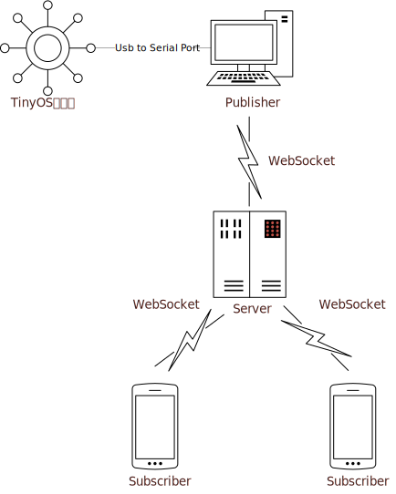

# Tiny OS 物联网实时数据显示 - WSN Web

这是一个学校**无线传感网**课程设计项目，基于 **WebSocket** 实现的实时数据显示

## 开始 - Getting Started

[WebSocket - A Push(Server) Technology](https://zh.wikipedia.org/wiki/WebSocket)

### 架构设计



### 技术栈 & 依赖 - Built With

-   Node.js - A JavaScript runtime built on Chrome's V8 JavaScript engine.
-   React.js - A JavaScript library for building user interfaces.
-   Golang - Go is an open source programming language that makes it easy to build simple, reliable, and efficient software.
-   Material-UI - The world's most popular React UI framework.
-   ws - A Node.js WebSocket library.
-   tarm/serial - Go (golang) serial library for modbus.

### 部署 - Deployment

1. 在`TinyOS`平台构建起无线传感节点（略，参看手册说明）
2. 基站入网（由于节点没有无线通信模块，通过串口连接至电脑，由电脑的发布者程序统一发送数据至服务程序）
3. 启动服务 - Server

服务程序位于`server`文件夹

```bash
cd ./WSN-Web/server
yarn
yarn start
```

4. 发布者 - Publisher

串口数据样例

```
h29.430000
l1204
s69.750380
c1
```

根据串口选择合适的端口及参数，切换至终端

```bash
cd ./WSN-Web/publish
go run publisher.go
```

5. 订阅者 - Subscriber

到根目录执行

```bash
cd ./WSN-Web
yarn
yarn start
```

### 改进想法

-   基于阿里云 [MQTT over WebSocket](https://www.alibabacloud.com/help/zh/doc-detail/63656.htm)

-   加入数据可视化

-   influxDB 实时数据库

-   目前只能使用`http`和`ws`协议，`https`和`wss`需要自行配置 TLS 证书

## License

This project is licensed under the MIT License - see the [LICENSE](LICENSE) file for details
